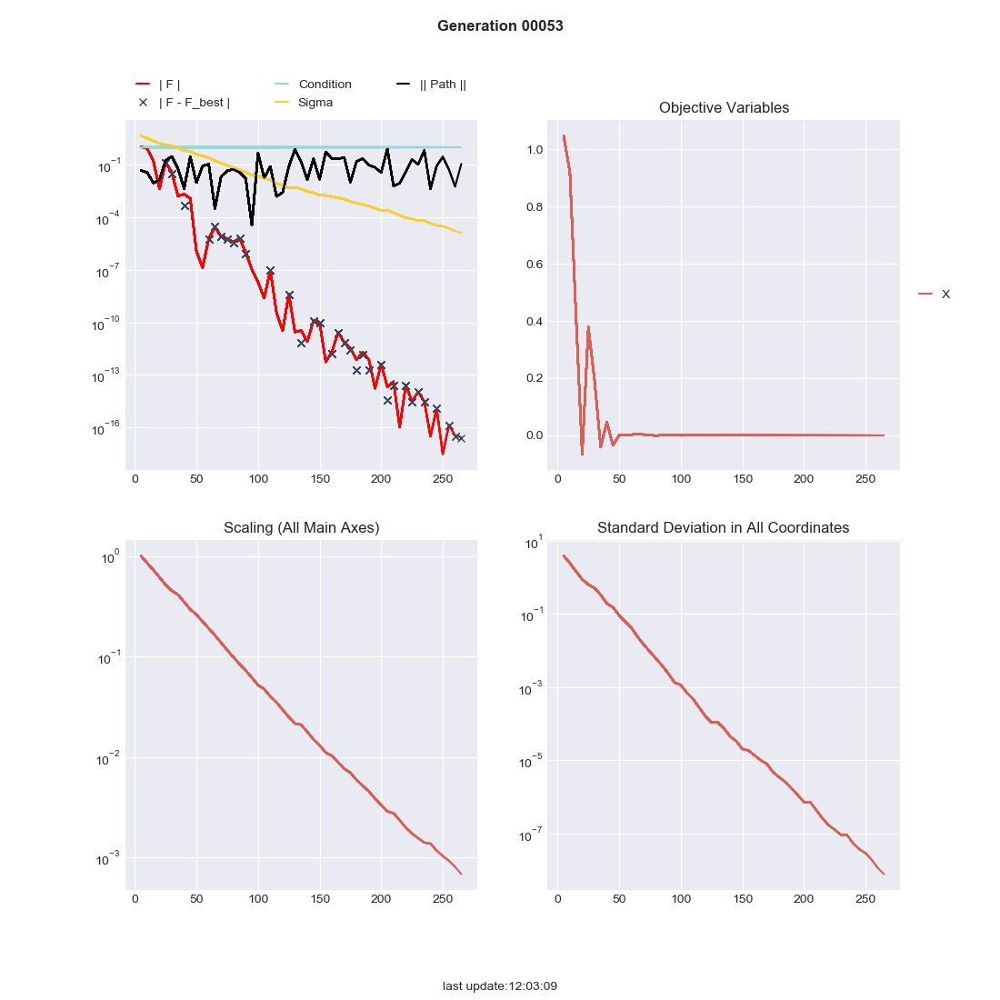

In this tutorial we show how to **optimize** and **sample** directly from a
given function.

The code in **Python** for this tutorial can be found [here](https://github.com/cselab/skorali/blob/master/examples/python/quick_start/direct.py) and the code in **C++** can be found [here](https://github.com/cselab/skorali/blob/master/examples/cxx/quick_start/direct.cpp).


## Problem setup
We are given the function $g(\vartheta)=\exp(-\vartheta^2)$ for $\vartheta\in[-10,10]$.

First we want to find the maximum of the function in the given interval.

!!! tip
    Since $\exp$ is monotonically increasing function, g has the same optima
    as $\log g$.

Next, we assume that $f$ represents the *unnormalized* density of a distribution.
We want to draw samples from this distribution.

!!! note
    For stability reasons, the sampling algorithm works with the $\log$ of an unnormalized density.

For the rest of the tutorial we will work with the function $f(\vartheta)=\log g(\vartheta) = -\vartheta^2$.


## Optimize

First import the needed modules
```python
#!/usr/bin/env python
import sys
import threading
import libkorali
```

### 1. The computational model
Then write the code for $f$
```python
def F( s ):
    x = s.getParameter(0)
    r = -x*x
    s.addResult(r)
```


### 2. The korali object

Next we construct a `korali` object using the function `F`
```python
korali = libkorali.Engine( F )
```

### 3. The Problem type
Then, we set the type of the problem to `Direct Evaluation`
```python
korali["Problem"]["Objective"] = "Direct Evaluation"
```

### 4. The Parameters
```python
korali["Parameters"][0]["Name"] = "X"
korali["Parameters"][0]["Distribution"] = "Uniform"
korali["Parameters"][0]["Type"] = "Computational"
korali["Parameters"][0]["Minimum"] = -10.0
korali["Parameters"][0]["Maximum"] = +10.0
```

### 5. The Solver
```python
korali["Solver"]["Method"] = "CMA-ES"
korali["Solver"]["Termination Criteria"]["Min DeltaX"] = 1e-8
korali["Solver"]["Termination Criteria"]["Max Generations"] = 100
korali["Solver"]["Lambda"] = 5
```

### 6. Run
```python
korali["Seed"] = 0xC0FFEE;
korali["Verbosity"] = "Detailed";
```


```python
korali.run();
```





## Sample

### 1. The Solver

```python
korali["Solver"]["Method"] = "TMCMC"
korali["Solver"]["Covariance Scaling"] = 0.02
korali["Solver"]["Population Size"] = 5000
korali["Solver"]["Burn In"] = 5
```
