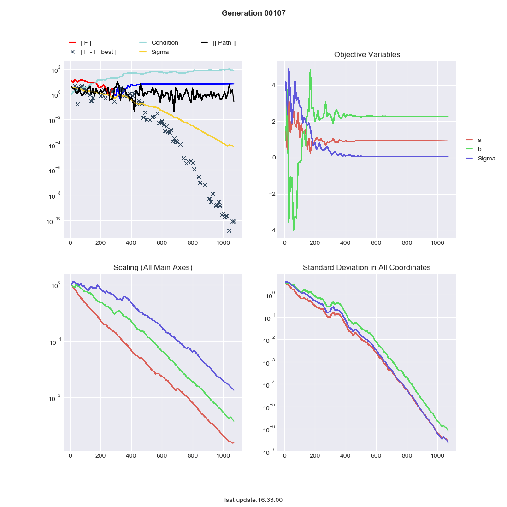
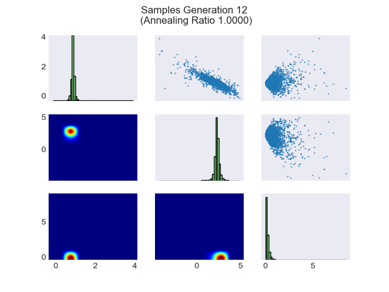

In this tutorial we show how to **optimize** and **sample** the posterior
distribution of a Bayesian inference problem.


The code for this tutorial in **Python** can be found [here](https://github.com/cselab/skorali/blob/master/examples/python/quick_start/posterior.py) and the code in **C++** can be found [here](https://github.com/cselab/skorali/blob/master/examples/cxx/quick_start/posterior.cpp).


## Problem setup
In this example we will solve the inverse problem of estimating the parameters
of a linear model using noisy data. We consider the computational model,

$$
f(x;\vartheta) = \vartheta_0 + \vartheta_1 x \,,
$$

for $x\in\mathbb{R}$. We assume the following error model,

$$
y = f(x;\vartheta) + \varepsilon \,,
$$

with $\varepsilon$ a random variable that follows normal distribution with zero
mean and $\sigma$ standard deviation. This assumption leads to the likelihood
function,

$$
p(y|\varphi;x) = \mathcal{N} ( \,y \,| \, f(x;\vartheta), \sigma^2 \,) \,.
$$

where $\varphi=(\vartheta,\sigma)$ is the parameter vector that contains the
computational parameters and the parameters of the statistical model.

We assume that we are given the following data set:

<center>

| $x_i$  | $y_i$  |
|:-:|:-:|
| 1  | 3.2069  |
| 2  | 4.1454  |
| 3  | 4.9393  |
| 4  | 6.0588  |
| 5  | 6.8425  |

</center>

We call this data set $d=\{x_i,y_i\}_{i=1}^5$. Assuming that each datum is
independent, the likelihood of $d$ under the linear model is given by

$$
p(y|\vartheta;x) = \prod_{i=1}^6 \mathcal{N} ( \,y_i \,| \, f(x_i;\vartheta), \sigma^2 \,) \,.
$$

In order to identify the distribution of $\varphi$ conditioned on the observations $d$
we use Bayes' theorem

$$
p(\varphi | y;x) = \frac{ p(y|\varphi;x) \, p(\varphi) }{ p(y) } \, .
$$


As a prior information we choose the uniform distribution in $[-10,10]$ for $\vartheta$
and the uniform distribution in $[0,10]$ for $\sigma$.


## Optimize
First import the needed modules
```python
#!/usr/bin/env python
import sys
import threading
import libkorali
```


### The computational model

We write a function that simulates the model $f(x;\vartheta) = \vartheta_0 + \vartheta_1 x$,

```python
def F( s, x ):
  for i in range(len(x)):
    th0 = s.getParameter(0)
    th1 = s.getParameter(1)
    r  =  th0*x[i] + th1
    s.addResult(r)

```

The object `s` must be of type `Korali::modelData`. This class provides the methods
`getParameter` and `addResult`. For a detailed presentation see [here]

### The data

The data in the table bellow are added as two Python lists,

```python
x=[];            y=[];
x.append(1.0);   y.append(3.2069);
x.append(2.0);   y.append(4.1454);
x.append(3.0);   y.append(4.9393);
x.append(4.0);   y.append(6.0588);
x.append(5.0);   y.append(6.8425);
```


### The Korali object

The `x` list corresponds to the *input* variables of the model. The function that
is passed to korali should not have an argument for `x`. We have to create an intermediate
lambda function `Fx` that will hide `x` from korali.

```python
Fx = lambda s: F( s, x )
```

or

```python
Fx = lambda s,*,x=x: F( s, x )
```
if we want to make sure that `Fx` will not change if `x` changes later. Then, we can create
the korali object,

```python
korali = libkorali.Engine( Fx )
```


### The problem type

The `Objective` `Problem` is characterized as `Bayesian`
```python
korali["Problem"]["Objective"] = "Bayesian";
```

When the objective is `Bayesian` we must also provide a vector with the `Reference Data`
to korali,

```python
for i in range(len(y)):
  korali["Problem"]["Reference Data"][i] = y[i];
```
or

```python
for ey in y:
  korali["Problem"]["Reference Data"] += ey;
```

### The parameters

We define two `Parameters` of type `Computational` that correspond to $\vartheta_0$ and $\vartheta_1$. The prior distribution of both is set to `Uniform`.

```python
    korali["Problem"]["Variables"][0]["Name"] = "a";
    korali["Problem"]["Variables"][0]["Type"] = "Computational";
    korali["Problem"]["Variables"][0]["Distribution"] = "Uniform";
    korali["Problem"]["Variables"][0]["Minimum"] = -5.0;
    korali["Problem"]["Variables"][0]["Maximum"] = +5.0;
    korali["Problem"]["Variables"][0]["Initial Mean"] = +1.0;

    korali["Problem"]["Variables"][1]["Name"] = "b";
    korali["Problem"]["Variables"][1]["Type"] = "Computational";
    korali["Problem"]["Variables"][1]["Distribution"] = "Uniform";
    korali["Problem"]["Variables"][1]["Minimum"] = -5.0;
    korali["Problem"]["Variables"][1]["Maximum"] = +5.0;
    korali["Problem"]["Variables"][1]["Initial Mean"] = +1.0;

```

The last parameter we add is of `Type` `Statistical` and corresponds to the variable
$\sigma$ in the likelihood function,

```python
  korali["Problem"]["Variables"][2]["Name"] = "Sigma";
  korali["Problem"]["Variables"][2]["Type"] = "Statistical";
  korali["Problem"]["Variables"][2]["Distribution"] = "Uniform";
  korali["Problem"]["Variables"][2]["Minimum"] = 0.0;
  korali["Problem"]["Variables"][2]["Maximum"] = 10.0;
  korali["Problem"]["Variables"][2]["Initial Mean"] = +1.0;
```

### The solver

Next, we choose the solver `CMA-ES`, the population size to be `12` and set
four termination criteria,

```python
  korali["Solver"]["Method"] = "CMA-ES";
  korali["Solver"]["Lambda"] = 12;
  korali["Solver"]["Termination Criteria"]["Min DeltaX"] = 1e-11;
  korali["Solver"]["Termination Criteria"]["Min Fitness"] = 1e-12;
  korali["Solver"]["Termination Criteria"]["Max Generations"] = 1e4;
  korali["Solver"]["Termination Criteria"]["Max Model Evaluations"] = 1e4;
```

For a detailed description of CMA-ES settings see [here](../../usage/solvers/optimizers/cmaes.md).


### Run

We set the `Seed` to a fixed value and the `Verbosity` level to the maximum available,


```python
  korali["Seed"] = 0xC0FFEE;
  korali["Verbosity"] = "Detailed";
```

Finally, we are ready to run the simulation,

```python
  korali.run();
```


### Plot

You can see the results of CMA-ES by running the command,
```sh
korali-plot
```




## Sample

### The solver

To sample the posterior distribution, we set the solver to `TMCMC` sampler and set a few settings,

```python
  korali["Solver"]["Method"] = "TMCMC";
  korali["Solver"]["Covariance Scaling"] = 0.02;
  korali["Solver"]["Population Size"] = 5000;
  korali["Solver"]["Burn In"] = 5;
  korali["Solver"]["Coefficient of Variation"] = 0.5;
```

For a detailed description of the TMCMC settings see [here](../../usage/solvers/samplers/tmcmc.md)


### Plot

You can see a histogram of the results by running the command
```sh
korali-plot
```



