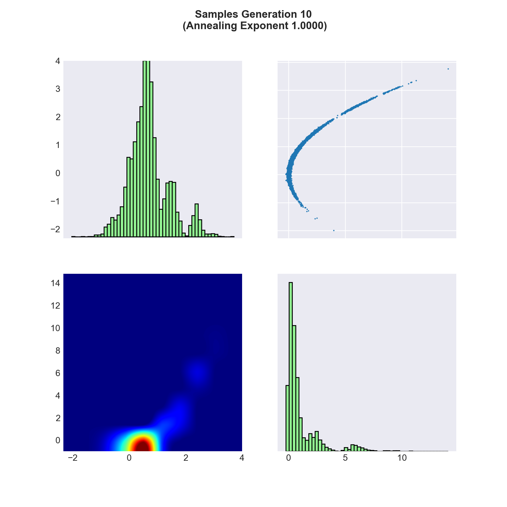

# Solvers / TMCMC
   				   
##Description

This is the implementation of the *Transitional Markov Chain Monte Carlo* algorithm, as published in [Ching2007](https://ascelibrary.org/doi/abs/10.1061/%28ASCE%290733-9399%282007%29133%3A7%28816%29).

TMCMC avoids sampling from difficult target probability densities (e.g. posterior distributions in a Bayesian inference problem) but samples from a series of intermediate PDFs that converge to the target PDF. This technique is also known as Sampling Importance Resampling in the Bayesian community.

**Requirements:**

+ The *Population Size* used at every generation needs to be defined.
+ The *Problem* needs to be of type Bayesian.

##Settings

??? abstract "Result Output Frequency"

	Specifies the output frequency of intermediate result files. By default, Korali will set this value to *1* (i.e. each generation). Example:

	```python
    # Reduce the number of result files
	k["TMCMC"]["Result Output Frequency"] = 10

	```

??? abstract "Population Size"

	Specifies the number of samples drawn from the posterior distribution at each generation.

	```python
	# Specifying Population Size
	k["TMCMC"]["Population Size"] = 10000

	```

??? abstract "Burn In"

	Specifies the number of additional MCMC steps per sample per generation. Note that only the last sample per chain is considered for the recombination. By default, Korali sets this value to 0. Example:

	```python
    # Execute additional Burn In steps
	k["TMCMC"]["Burn In"] = 5
	```
	
??? abstract "Coefficient of Variation"

	Target coefficient of variation to search for the exponent $\rho_{i+1}$. By default, Korali will set this value to 1.00 as suggested in [Ching2007]. Example:

	```python
    # Reduce CoV for smoother transitions between intermediate PDFss
	k["TMCMC"]["Coefficient of Variation"] = 0.2
	```

??? abstract "Covariance Scaling" 

	Covariance scaling factor $\beta^2$ of proposal distribution. By default, Korali sets this value 0.04 as suggested in [Ching2007]. Example:

	```python
    # Reduce Covariance Scaling factor
	k["TMCMC"]["Covariance Scaling"] = 0.01
	```	
	
??? abstract "Use Local Covariance"

	If set $True$, TMCMC calculates a local covariance matrix per sample from its neighbours. By default, Korali sets this value to $False$. Example:

	```python
    # Use Local Covariance
	k["TMCMC"]["Mu"]["Use Local Covariance"] = True
	```	
	
??? abstract "Min Rho Update"

	Minimum increment of the exponent $\rho_{i+1}$. This parameter prevents TMCMC from not making progres. By default, Korali sets this value to $10^{-5}$. Example:

	```python
    # Increase Min Rho Update
	k["TMCMC"]["Min Rho Update"] = 0.01
	```	
	
??? abstract "Max Rho Update"

	Maximum increment of the exponent $\rho{i+1}$. By default, Korali will set this value to 1.0 (inactive). Example:

	```python
    # Reduce Max Rho Update
	k["TMCMC"]["Max Rho Update"] = 0.2
	```	

## Termination Criteria

??? abstract "Max Generations"

	Specifies the maximum number of generations to run. By default, Korali sets this value to 20. Example:

	```python
    # Increase Max Generations
	k["TMCMC"]["Termination Criteria"]["Max Generations"]["Active"] = True
	k["TMCMC"]["Termination Criteria"]["Max Generations"]["Value"]  = 50
	```

## Plotting

Here we explain technical details of the **TMCMC** result plot.

The `python3 -m korali.plotter` command plots the distribution of the samples at every
generation. The samples are read from the json-files stored in the output
directory (`/_korali_result/`).

A plot of the samples obtained after the final generation of TMCMC
function is given below. Here, the target function is the exponential of the 
negative of the 2-dimensional [Rosenbrock](https://en.wikipedia.org/wiki/Rosenbrock_function) 
function.



**Diagonal Plots**. The diagonal plots show the marginal probability densities of the samples for 
each variable. Note that the indices of the vertical axes correspond to the 
upper and lower triangle plot and not to the diagonal plots.

**Upper Triangle**. In the plots in the upper triangle we see the actual realization of the samples. 
The axes represent the dimensions, respectively the objective variables,
of the problem and we show a two-dimensional plot for every variable pair.

**Lower Triangle**. The lower triangle shows the probability density of the samples for each variable pair.
The density is approximated through a smoothening operator applied to the number
of samples that can be found in a given area.
